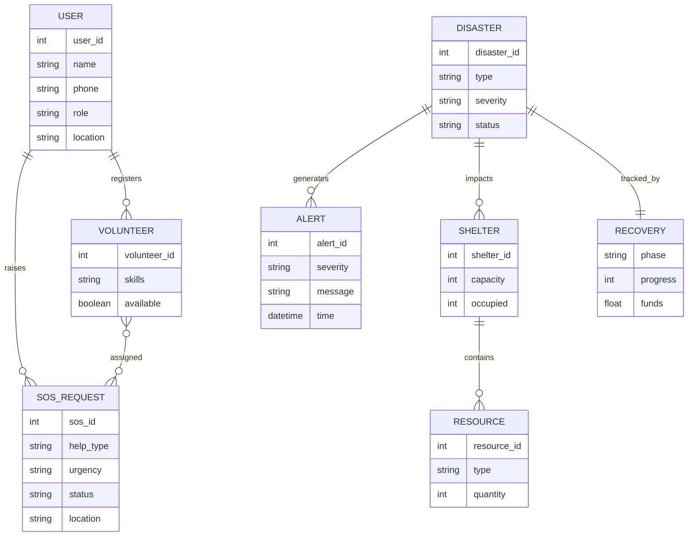

### Disaster Management System ER Diagram

```mermaid
erDiagram
    USER ||--o{ SOS_REQUEST : raises
    USER ||--o{ VOLUNTEER : registers
    DISASTER ||--o{ ALERT : generates
    DISASTER ||--o{ SHELTER : impacts
    VOLUNTEER }o--o{ SOS_REQUEST : assigned
    SHELTER ||--o{ RESOURCE : contains
    DISASTER ||--|| RECOVERY : tracked_by

    USER {
        int user_id
        string name
        string phone
        string role
        string location
    }

    SOS_REQUEST {
        int sos_id
        string help_type
        string urgency
        string status
        string location
    }

    ALERT {
        int alert_id
        string severity
        string message
        datetime time
    }

    DISASTER {
        int disaster_id
        string type
        string severity
        string status
    }

    VOLUNTEER {
        int volunteer_id
        string skills
        boolean available
    }

    RESOURCE {
        int resource_id
        string type
        int quantity
    }

    SHELTER {
        int shelter_id
        int capacity
        int occupied
    }

    RECOVERY {
        string phase
        int progress
        float funds
    }
```
