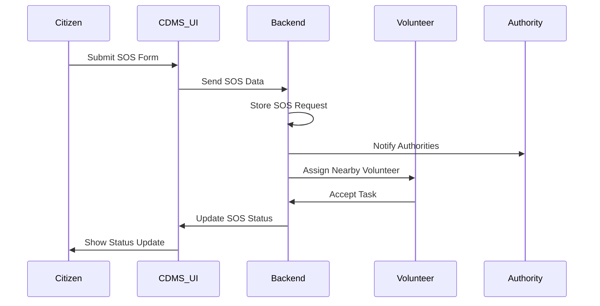

### SOS Request Sequence Diagram

```mermaid
sequenceDiagram
    participant Citizen
    participant CDMS_UI
    participant Backend
    participant Volunteer
    participant Authority

    Citizen->>CDMS_UI: Submit SOS Form
    CDMS_UI->>Backend: Send SOS Data
    Backend->>Backend: Store SOS Request
    Backend->>Authority: Notify Authorities
    Backend->>Volunteer: Assign Nearby Volunteer
    Volunteer->>Backend: Accept Task
    Backend->>CDMS_UI: Update SOS Status
    CDMS_UI->>Citizen: Show Status Update
```
