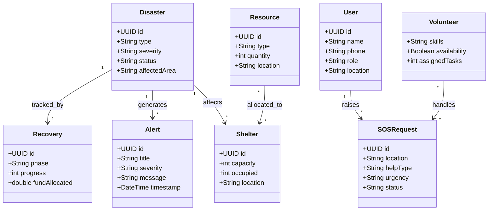

### Disaster Management System Class Diagram

```mermaid
classDiagram
    Disaster "1" --> "1" Recovery : tracked_by
    Disaster "1" --> "*" Alert : generates
    Resource "*" --> "*" Shelter : allocated_to
    Disaster "1" --> "*" Shelter : affects
    User "1" --> "*" SOSRequest : raises
    Volunteer "*" --> "*" SOSRequest : handles

    class Disaster {
        +UUID id
        +String type
        +String severity
        +String status
        +String affectedArea
    }

    class Recovery {
        +UUID id
        +String phase
        +int progress
        +double fundAllocated
    }

    class Resource {
        +UUID id
        +String type
        +int quantity
        +String location
    }

    class Alert {
        +UUID id
        +String title
        +String severity
        +String message
        +DateTime timestamp
    }

    class Shelter {
        +UUID id
        +int capacity
        +int occupied
        +String location
    }
    
    class User {
        +UUID id
        +String name
        +String phone
        +String role
        +String location
    }
    
     class Volunteer {
        +String skills
        +Boolean availability
        +int assignedTasks
    }

     class SOSRequest {
        +UUID id
        +String location
        +String helpType
        +String urgency
        +String status
    }
```
